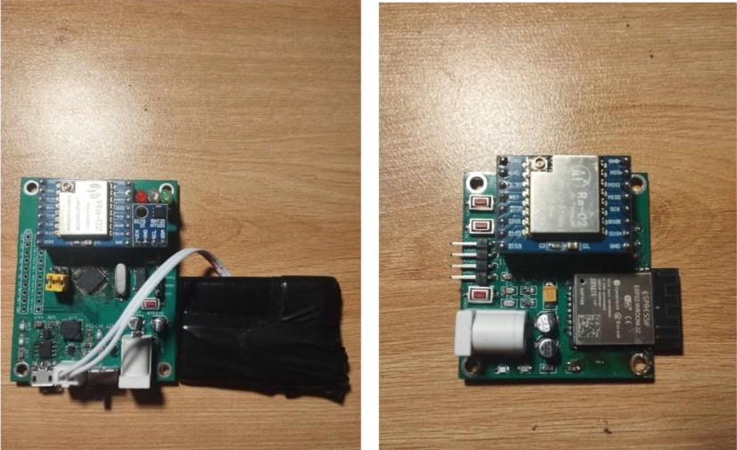
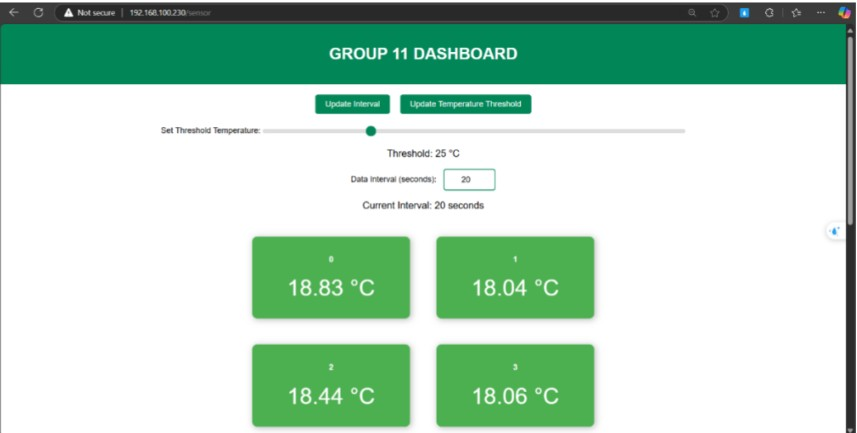
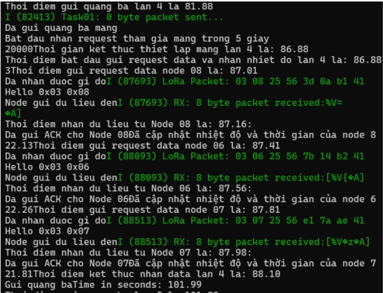

# LoRa-based Wireless Sensor Network (WSN) for Environmental Monitoring

This project implements a professional **Wireless Sensor Network (WSN)** utilizing **LoRa** technology to monitor environmental data (temperature and humidity). The system is built on a **Star Topology** using a **Polling Mechanism** to ensure reliable data collection from multiple nodes to a central Gateway.

## ## Network Topology
The system follows a **Star Network** architecture. The Gateway acts as the Master, sequentially requesting data from each Node (Slaves) using a Polling protocol to eliminate packet collisions and ensure data integrity.


*Figure 1: Star Topology with 11 Nodes and 1 Central Gateway.*

## ## Technical Specifications
The system is designed to meet high-performance requirements for real-time monitoring:

| Feature | Requirement | Achievement |
| :--- | :--- | :--- |
| **Number of Devices** | 11 Nodes | Scalable to 50+ Nodes |
| **Data Collection Latency** | < 10 seconds | ~ [Insert Value] s |
| **Sampling Period** | < 120s (Advanced: < 20s) | Optimized at 20s |
| **Communication Protocol** | LoRa (Long Range) | High Penetration/Long Range |
| **Access Method** | Polling | Zero Collision |

## ## Smart Alert System (LED Indicators)
Each sensor node is equipped with a 3-color LED system for real-time local status monitoring:

*   🟢 **Green LED:** System is stable; temperature is within the safe threshold.
*   🔴 **Red LED:** Alert! Temperature has exceeded the pre-defined threshold.
*   🟡 **Yellow LED:** The node is currently joining the network or associating with the Gateway.

## ## Project Results & Demonstrations

### ### 1. Hardware Implementation (Node & Gateway)
Actual photos of the deployed LoRa nodes and the central Gateway unit.

*Figure 2: Prototype of the Sensor Node and Gateway.*

### ### 2. Monitoring Dashboard
Real-time visualization of temperature and humidity data across all 11 nodes.

*Figure 3: Real-time monitoring interface for environmental data.*

### ### 3. Gateway Management Logs
Detailed logs showing the Gateway's management activities, including polling cycles and node status.

*Figure 4: Gateway log system for node management and packet tracking.*

## ## Installation & Usage

### 1. Hardware Setup
*   **Microcontroller:** ESP32.
*   **LoRa Module:** SX1278 (433MHz).
*   **Sensors:** SHT21 or equivalent.

### 2. Software Configuration
Clone this repository:
    ```bash
    git clone https://github.com/your-username/lora-wsn-system.git
    ```


## ## Key Features
*   **Low Power Consumption:** Optimized for battery-powered sensor nodes.
*   **High Reliability:** Polling mechanism ensures no data loss due to interference.
*   **Scalability:** Easily add more nodes by registering new IDs at the Gateway.

---
**Author:** [Your Name]  
**Contact:** [Your Email/LinkedIn]  
**Project Date:** December 2024